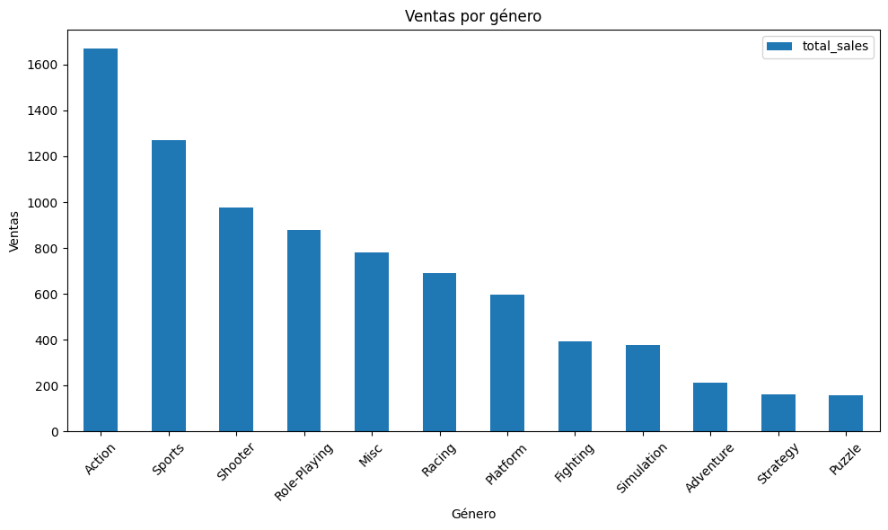
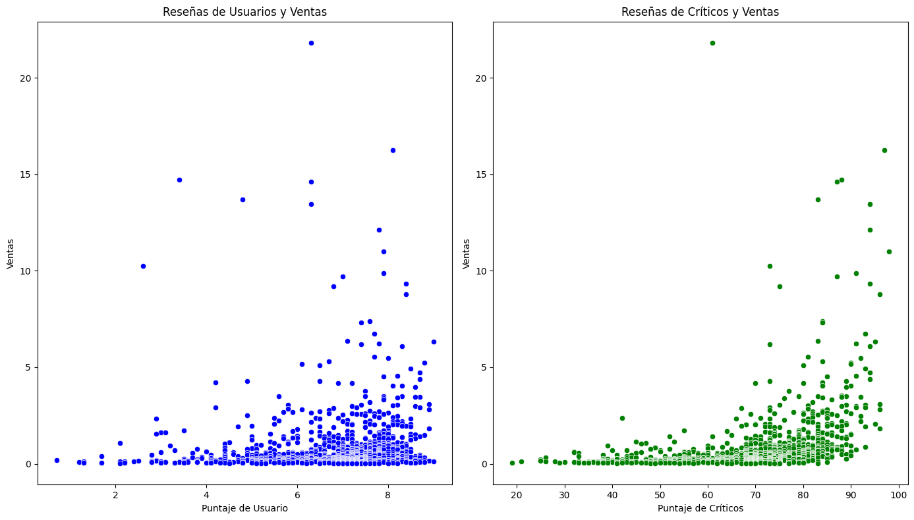
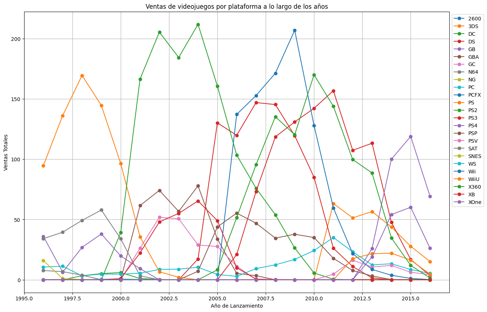
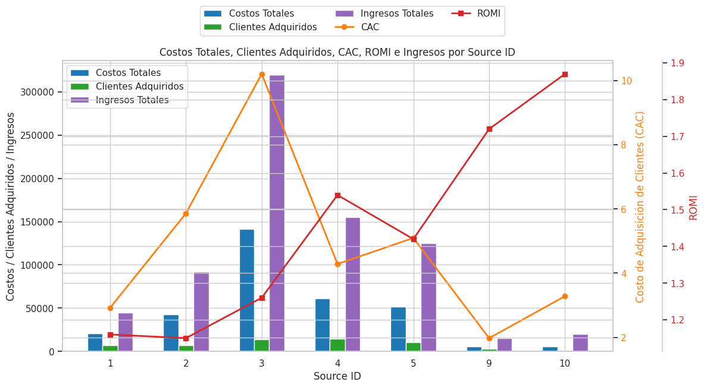
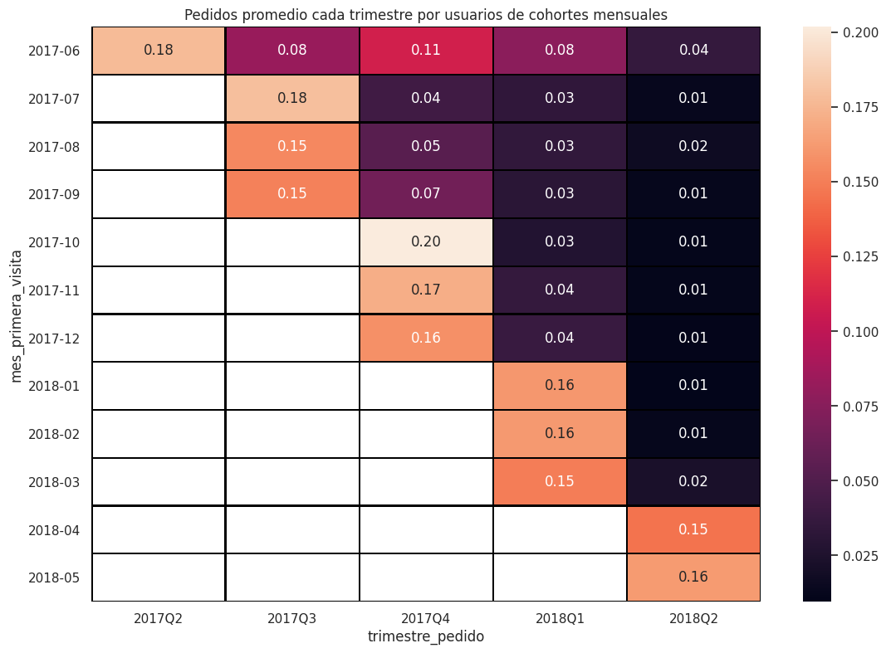
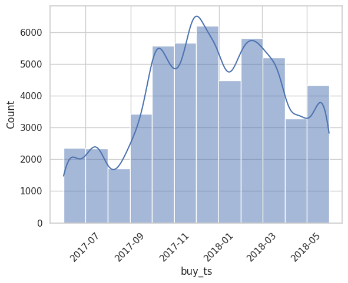

# About Me

Data analyst with experience in strategic analysis, institutional communication, and process optimization. I enjoy simplifying complex information and transforming data into actionable insights tailored to diverse audiences and stakeholders.

My career spans journalism, education, government, and consulting, which has equipped me with a well-rounded perspective to turn complex datasets into meaningful narratives that support informed decision-making.

### Technical skills

-Analysis and data management with Excel/SQL/Python
-Data visualization and story narration with Power BI/Tableau

### Core competencies

Assertive communication | Stakeholder Engagement | Critical Thinking & Problem Solving | Process Documentation & Quality Standards | Training Lead

# Selected Projects
## Videogame sales analysis

This project analyzes video game sales by region, platform, and genre to __identify key patterns and insights__ that can inform and enhance publicity campaigns. By understanding market dynamics in North America, Europe and Japan, we aim to __optimize marketing strategies and maximize the return on investment__ for the most profitable titles and platforms.

#### Tools and type of project

### Key questions

1.Which platforms have the highest global sales, and how do these vary by region?
2.Which video game genres are most popular in North America, Europe, and Japan?
3.What is the relationship between user/critic scores and global video game sales?
4.Are there significant differences in average ratings across platforms and genres?

### Methodology
-__Data preprocessing__:Data cleaning (missing values, duplicates, column format and appropiate data types)
-__Exploratory data analysis__:Identification of the most popular platforms and genres, and evaluation of the correlation between user/critic scores and sales.
-__Regional segmentation__: Comparison of platform and genre preferences in North America, Europe, and Japan.
-__Hypothesis testing__: Comparison of average ratings across platforms and genres.

###Insights and Recommendations
#### Regional Differences in Platform and Title Sales
-Sales data reveals __notable differences across regions__ in terms of top-performing platforms and video game titles.
-Understanding the __industry context__ is essential-market behavior varies by region, and insights are richer when combined with domain knowledge.

#### Platform Lifecycles and Strategic Timing
-Although some platforms showed __strong historical sales, many had already __peaked by 2017__ and were declining by the time of analysis.
-The launch of __next-generation consoles in 2020__ was foreseeable in 2017, as both hardware and major game titles were nearing final development stages.

#### Review Scores and Sales Correlation
-A __stronger positive correlation__ was found between __critic scores__ and games sales than between user scores and sales.
-This may be due to the __promotional impact of critic reviews__, which tend to have greater media visibility.
-Nonetheless, some games with __low critic ratings still sold well__, showing that critic influence is significant but no definitive.

#### Data Processing as a Foundation for Insight
-Reliable analysis required extensive __data cleaning and preprocessing__, including handling missing values, duplicates, and column formatting.
-Proper data manipulation enabled the creation of __effective visualizations__ and more accurate interpretations.

### Featured Visualizations

#### Sales Distribution by Genre

- The genres with the highest sales are Action, Sports, Shooter and Role-Playing
- The genres with the lowest sales are Strategy and Puzzle.

#### Review scores and sales correlation

-Manipulated the dataset to enable **comparative visualizations** across key variables.
- Analyzed the correlation between **user scores vs. sales** and **critic reviews vs. sales**.
- Identified a **stronger positive correlation** between critic scores and sales, while user scores showed a more **scattered relationship**.

#### Chronological sales distribution by platform

- Identified **six historically high-selling platforms**, along with their peak sales periods:  
  - PlayStation (1995–2002)  
  - PlayStation 2 (2000–2008)  
  - Nintendo DS (2004–2011)  
  - Nintendo Wii (2006–2012)  
  - Xbox 360 (2005–2015)  
  - PlayStation 3 (2006–2015)

- More recent top-selling platforms include: **PlayStation 4, Xbox One, and Wii U**.

-We identified that older platforms typically reached peak sales in 4–6 years, while newer platforms seem to peak faster—around 3 years—and with lower overall sales.

Explore more project details in the [full repository](https://github.com/romeand/Data_analytics_portfolio/blob/a761dfa35c2927441f2489d72ee4308c638e7893/Sprint%206%20Proyecto%20Integrado%20modulo%201.ipynb).

## User Behavior Analysis and Sales Funnel

This project analyzes the sales funnel to track user progression through purchase stages, identifying drop-off points and bottlenecks. Conducted an A/A/B test to assess the impact of font changes on user behavior, ensuring control groups were statistically similar before drawing conclusions. Provided actionable insights to the design and management teams, balancing aesthetics with user experience.

#### Tools and type of project

### Key Questions

- Which events in the sales funnel have the highest drop-off rates?
- What percentage of users complete the funnel from start to payment?
- Does the change in font design significantly affect conversion rates?
- Are there statistically significant differences between the control groups and the test group?

### Methodology

- **Data preprocessing**: Renamed columns, removed duplicates, and filtered out incomplete records.
- **Sales funnel analysis**: Identified key events and calculated the proportion of users progressing through each stage.
- **A/A/B experimentation**: Compared conversion rates between control and test groups using statistical hypothesis testing.

###Final Insights and Recommendations

### 1. Eliminate Low-Return Sources (1, 2, and Possibly 3)

- Sources 1 and 2 show a **low Return on Marketing Investment (ROMI)** and are recommended for **elimination**.
- Source 3, while generating **high revenue and a positive ROMI**, has the **highest Customer Acquisition Cost (CAC)**. This reduces its efficiency, and reallocating its budget to more profitable sources may be advisable.

### 2. Focus Investment on Source 4

- Source 4 demonstrates a **strong ROMI**, **lower CAC**, and is the **second highest in customer acquisition**.
- It's recommended to **concentrate efforts and budget on Source 4**, potentially by reallocating funds from Source 3 to maximize efficiency and results.

### 3. Reassess Source 5 Performance

- Source 5 shows **stable behavior** without standing out in ROMI or spending.
- It may be left **unchanged** or slightly **reduced in budget** to test performance consistency while freeing resources for higher-potential sources.

### 4. Explore Growth Potential in Sources 9 and 10

- Sources 9 and 10 currently have **minimal spend, revenue, and market share**, but deliver an **exceptionally high ROMI**.
- A moderate **increase in investment** is recommended to assess whether their high ROMI can be sustained at scale.

### Featured Visualizations

#### Cohort heatmap

- In the third quarter, we observe a **slight improvement**, at least for the first cohort.  
- This suggests the need to analyze the **potential impact of marketing efforts or seasonality** during that time period.

#### Lifetime Value (LTV)

- Around **September 2017**, we observed an **increase in purchases**, which may indicate that certain advertising efforts were particularly effective during that period.  
- The **highest sales** occurred around **December 2017**, with another **strong performance in February 2018**.

Explore more project details in the [full repository](https://github.com/romeand/Data_analytics_portfolio/blob/a761dfa35c2927441f2489d72ee4308c638e7893/Sprint%209%20An%C3%A1lisis%20de%20negocio.ipynb).
